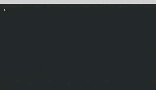
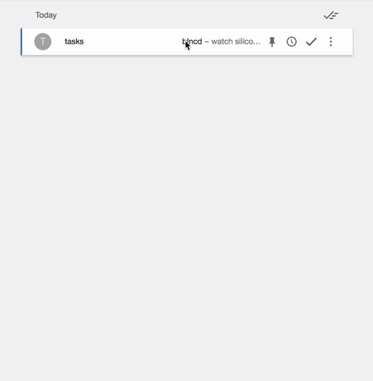

Home page: [http://blncd.io](http://blncd.io)

A minimal, opinionated task list for developers.  Based on Stephen Covey's quadrant based time management grid.  Command line interface.  Use your email app/client/website for on the go access.

*Command Line*  


*Email*  


## Install

```
$ npm install -g blncd
```

This will install a thin terminal client on your command line.  Code for this exists under a separate repository: [https://github.com/kwangbkim/blncd-cli](https://github.com/kwangbkim/blncd-cli)

## Usage
Details on using the cli/email interface can be found on the blncd homepage.  
[http://blncd.io/usage](http://blncd.io/usage)

## Developer Quickstart
Clone the project and download dependencies through npm.  

```
$ npm install
```

Add environment variables for MongoDB configuration.  This project uses [mLab](https://mlab.com/) for development which provides a free mongo sandbox.  Feel free to use your own provider or local instance.

```
BLNCD_DB_URL=dev mongo db url location
BLNCD_DB_USER=dev mongo username
BLNCD_DB_PASSWORD=dev mongo password
```

To run tests with code coverage

```
$ npm test
```

To start a local server on port 3000

```
$ npm start
```

## Similar Projects
[Todo.txt](https://github.com/ginatrapani/todo.txt-cli)  
[Taskwarrior](https://taskwarrior.org/)

## License
Copyright (c) 2016 Kwang Kim  
Licensed under the MIT license.
